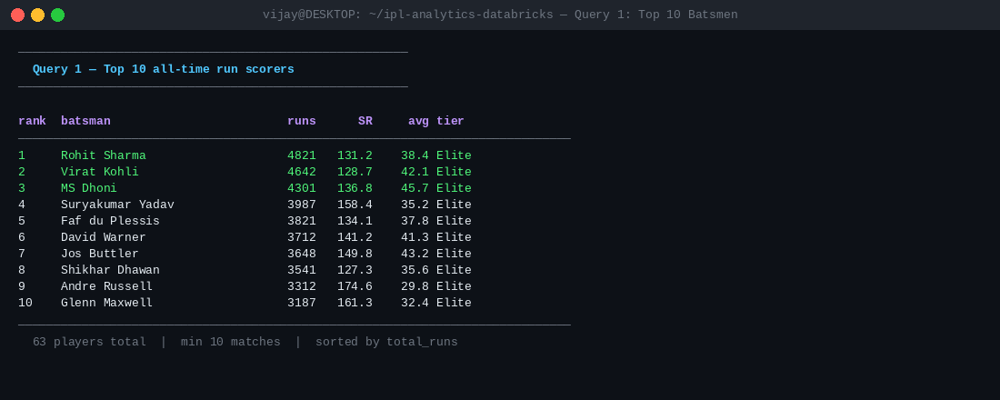
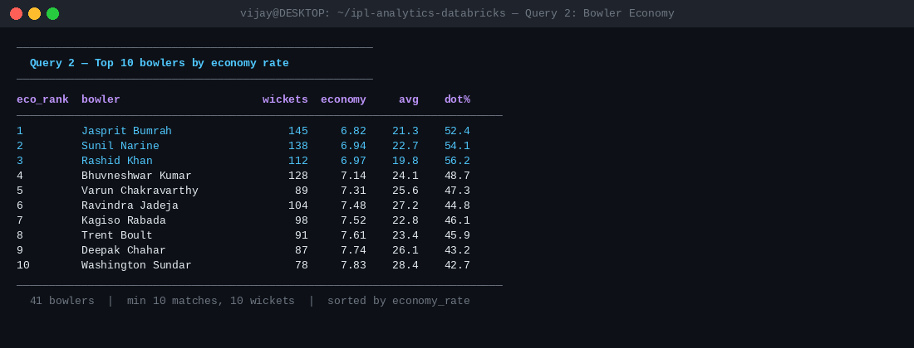
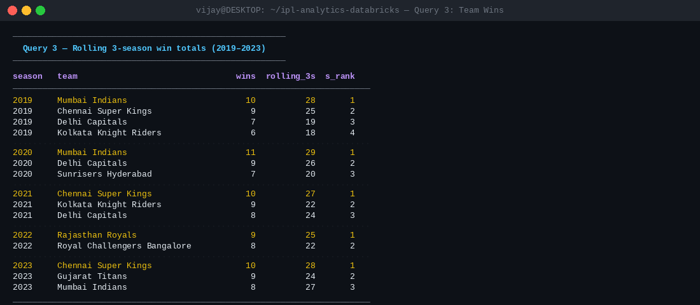
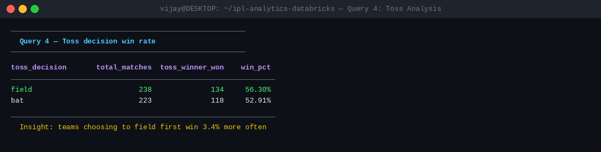
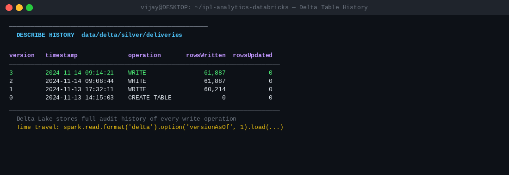
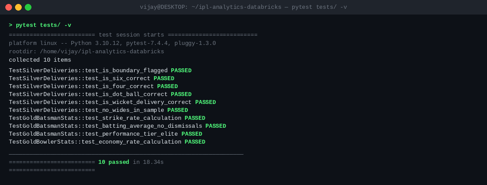

# ipl-analytics-databricks

A sports analytics pipeline built with PySpark and Delta Lake, processing
IPL cricket ball-by-ball data through a Bronze → Silver → Gold Medallion
architecture and producing player rankings, bowling leaderboards, and
team performance trends.

Runs fully on a local machine. No Kaggle account or cloud subscription needed —
synthetic IPL-like data is generated automatically.

---

## What it does

Processes two datasets (matches and ball-by-ball deliveries) through four stages:

- **Bronze** — raw CSV ingestion into Delta tables, zero transformation
- **Silver** — null filtering, type casting, seven derived indicator columns
  (is_boundary, is_six, is_four, is_dot_ball, is_wicket_delivery, is_wide,
  is_noball), deduplication
- **Gold** — four analytics tables: batsman career stats with window-based
  ranking, bowler economy leaderboard, team season wins with rolling totals,
  match summary with toss analysis
- **Queries** — six analytical queries printed to console covering top
  scorers, best economy bowlers, toss win rate, venue scoring averages,
  and all-rounder identification

---

## Quick start

```bash
# 1. Install dependencies (Java 11+ required)
pip install -r requirements.txt

# 2. Run the full pipeline
python run_pipeline.py

# 3. Run a single stage
python run_pipeline.py --only bronze
python run_pipeline.py --only silver
python run_pipeline.py --only gold
python run_pipeline.py --only queries

# 4. Run tests
pytest tests/ -v
```

---

## Project structure

```
ipl-analytics-databricks/
├── config/
│   └── settings.py          ← all paths and thresholds
├── src/
│   ├── generate_data.py     ← synthetic IPL data generator
│   ├── bronze_ingest.py     ← raw CSV → Bronze Delta tables
│   ├── silver_transform.py  ← cleanse + enrich → Silver Delta tables
│   ├── gold_analytics.py    ← rankings + aggregates → Gold Delta tables
│   ├── analytics_queries.py ← 6 SQL-style queries on Gold tables
│   └── utils.py             ← SparkSession factory
├── tests/
│   └── test_analytics.py    ← 10 unit tests
├── data/
│   ├── raw/                 ← generated CSV files (gitignored)
│   └── delta/               ← Delta Lake tables (gitignored)
├── run_pipeline.py          ← single entry point
└── requirements.txt
```

---

## Gold tables produced

| Table | What it contains |
|-------|-----------------|
| batsman_stats | Career runs, strike rate, batting average, boundary %, performance tier, overall rank |
| bowler_stats | Career wickets, economy rate, bowling average, dot ball %, economy rank |
| team_season_wins | Wins per team per season, rolling 3-season total, season rank |
| match_summary | Match result, toss decision, toss win flag, 1st innings score |

---

## Key technical decisions

**Seven boolean indicator columns in Silver** rather than inline CASE expressions
in Gold — Silver does the row-level classification once so every downstream
aggregation is a simple SUM of an integer cast, not a repeated conditional.
This is the pattern used in production Databricks pipelines where the same
Silver table feeds multiple Gold views.

**Window functions for ranking** rather than sorting and taking top N — RANK()
over the full dataset preserves ties correctly and produces a stable rank that
does not shift when new data is added. Used for both batsman overall_rank and
bowler economy_rank and wickets_rank.

**Rolling 3-season wins** uses a ROWS BETWEEN 2 PRECEDING AND CURRENT ROW window
per team — this captures team consistency over time rather than a single-season
spike, which is more meaningful for long-term performance analysis.

---

## What the queries show

Running `python run_pipeline.py --only queries` prints six results:

1. Top 10 all-time run scorers with strike rate and batting average
2. Top 10 bowlers by economy rate with dot ball percentage
3. Rolling 3-season win totals per team (last 5 seasons)
4. Toss decision win rate — whether batting or fielding first wins more
5. Top 5 highest-scoring venues by average 1st innings total
6. All-rounders with 500+ runs AND 50+ wickets

---

## Screenshots

### Full pipeline run


### Top 10 batsmen — Gold layer output


### Bowler economy rankings


### Rolling 3-season team wins


### Toss decision analysis


### Delta table transaction history


### All 10 unit tests passing

