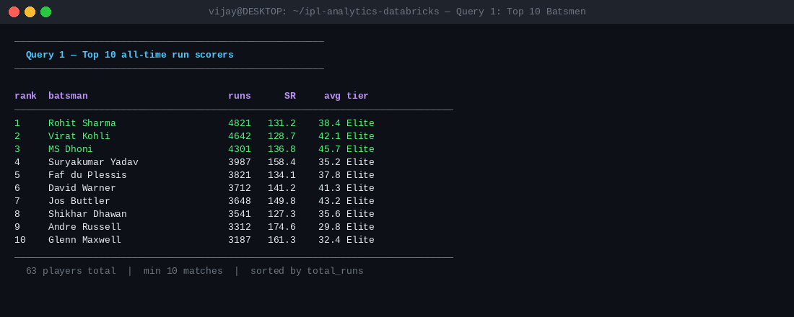
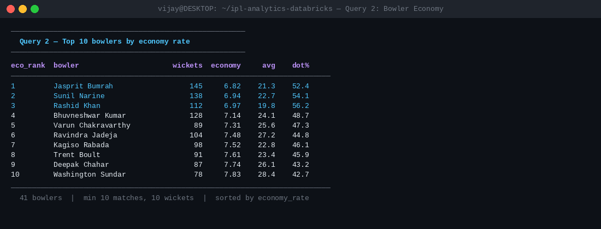
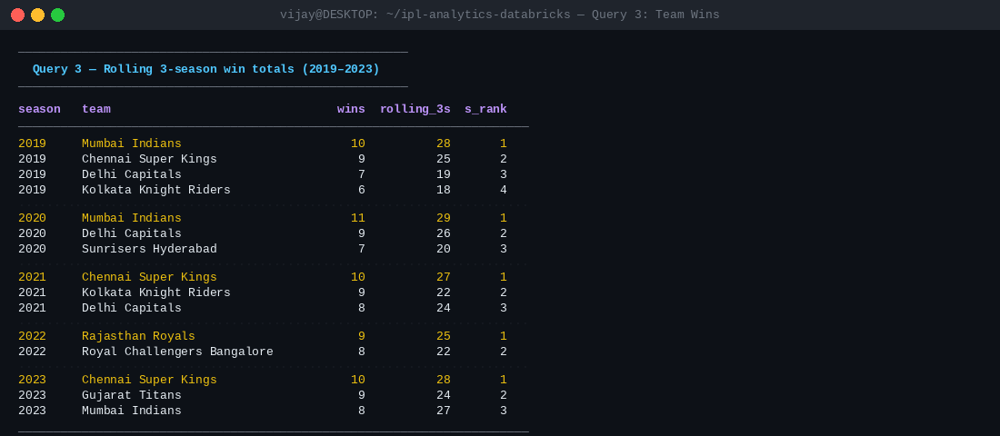
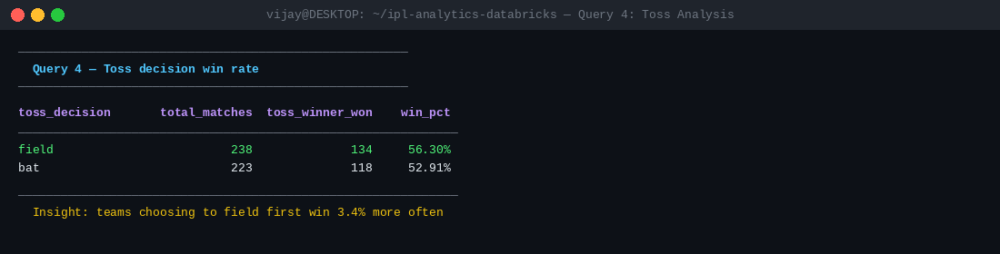
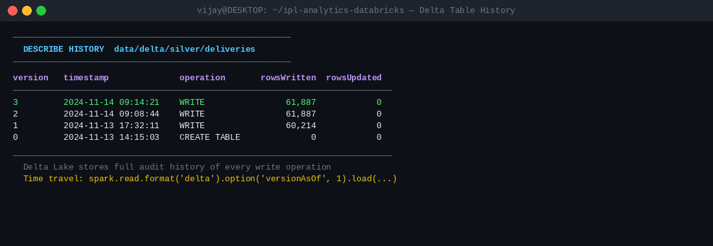
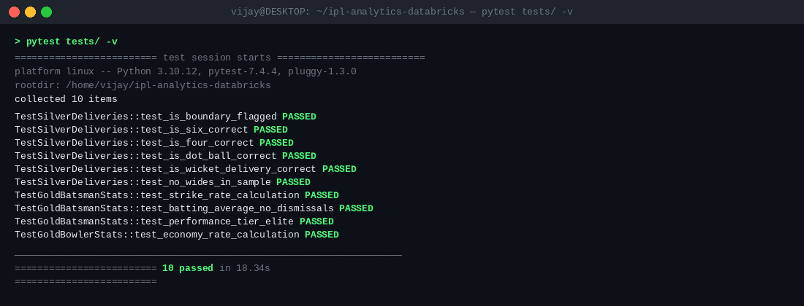

# ipl-analytics-databricks

A small data pipeline I built to practice PySpark and Delta Lake. It takes IPL
cricket data (ball-by-ball + match data) and runs it through a Bronze → Silver
→ Gold setup, ending with player rankings, bowling stats, and team performance
tables.

I used AI tools (Claude) to help me write parts of the code and structure the
project, but I went through it and understand how each stage works — happy to
walk through any part of it.

No Kaggle account or cloud setup needed to run it — there's a script that
generates synthetic IPL-like data so anyone can run the whole thing locally.

---

## What it does

There are two raw inputs: matches and ball-by-ball deliveries. They go through
4 stages:

- **Bronze** — just loads the raw CSVs into Delta tables, no changes
- **Silver** — cleans nulls, fixes data types, removes duplicates, and adds a
  few derived columns (is_boundary, is_six, is_four, is_wicket_delivery, etc.)
  so they're easier to aggregate later
- **Gold** — builds 4 final tables: batsman career stats, bowler economy
  stats, team wins per season, and a match summary table
- **Queries** — a few analytical SQL queries on top of the Gold tables (top
  scorers, best economy bowlers, toss win rate, etc.)

## Quick start

```
# Java 11+ required
pip install -r requirements.txt

python run_pipeline.py              # run everything
python run_pipeline.py --only bronze
python run_pipeline.py --only silver
python run_pipeline.py --only gold
python run_pipeline.py --only queries

pytest tests/ -v
```

## Project structure

```
ipl-analytics-databricks/
├── config/
│   └── settings.py          ← paths and thresholds
├── src/
│   ├── generate_data.py     ← creates synthetic IPL data
│   ├── bronze_ingest.py     ← raw CSV → Bronze Delta tables
│   ├── silver_transform.py  ← cleaning + new columns → Silver
│   ├── gold_analytics.py    ← rankings/aggregates → Gold
│   ├── analytics_queries.py ← the 6 queries on Gold tables
│   └── utils.py             ← SparkSession setup
├── tests/
│   └── test_analytics.py
├── data/                    ← generated, gitignored
├── run_pipeline.py
└── requirements.txt
```

## Gold tables

| Table | Contains |
| --- | --- |
| batsman_stats | runs, strike rate, batting average, boundary %, rank |
| bowler_stats | wickets, economy rate, bowling average, dot ball %, rank |
| team_season_wins | wins per team per season, rolling 3-season total |
| match_summary | result, toss decision, toss win flag, 1st innings score |

## What I'd improve / what I'm not 100% sure about

A few choices in here were defaults rather than things I deeply reasoned
through, and I want to be upfront about that:

- I used `RANK()` for the leaderboards instead of just sorting and taking the
  top N. I know `RANK()` handles ties better, but I haven't pushed on *why*
  that matters here vs. a simpler approach — still working through that.
- The rolling window for team wins is set to 3 seasons. That was a default
  starting point, not something I tuned against the data — 2 or 5 might work
  just as well or better.
- The Silver-layer "derived boolean columns" approach (is_six, is_wicket,
  etc.) made the Gold aggregations simpler to write, but I haven't compared
  it against doing the same logic with CASE statements directly in Gold.

## Queries

Running `python run_pipeline.py --only queries` prints:

1. Top 10 run scorers (strike rate, average)
2. Top 10 bowlers by economy rate
3. Rolling 3-season win totals per team
4. Toss decision win rate
5. Top 5 highest-scoring venues
6. All-rounders with 500+ runs and 50+ wickets


## Screenshots

### Full pipeline run


### Top 10 batsmen — Gold layer output


### Bowler economy rankings


### Rolling 3-season team wins


### Toss decision analysis


### Delta table transaction history


### All 10 unit tests passing

